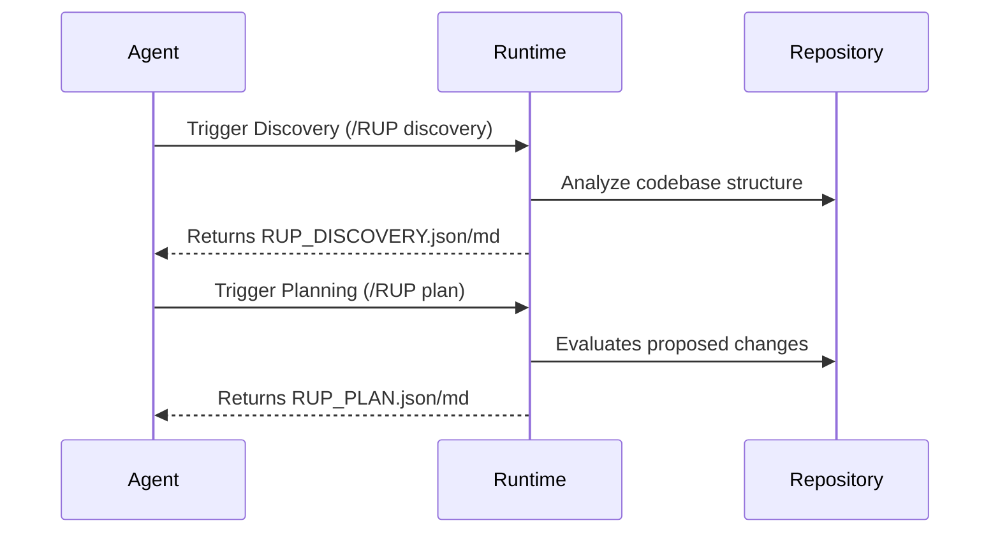

# Architecture

Skill-RUP operates as a bridge between the canonical upstream RUP methodology and the downstream execution capabilities of AI agents.

## Directory Structure
```text
SKILL.md
  -> workflows/                     (Agent readable projections)
  -> protocol/rup-protocol.yaml     (Canonical Authority)
  -> protocol/rup-schema.json       (Validation Authority)
  -> runtime/                       (Deterministic Execution Engine)
       cli.py, discovery.py, planning.py, execution.py, verification.py,
       reporting.py, rollback.py (platform-neutral rollback ops + CLI apply),
       workspace.py (monorepo package graph), tool_resolution.py (offline JS
       tooling), security.py (path jail + trust gate), command_runner.py
  -> schemas/                       (Standalone JSON Schemas)
  -> provenance/                    (Lineage mapping records)
  -> generated artifacts            (Output of the phases)
```

## State & Artifact Flow


## Lifecycle & Scoping

`Discovery -> Planning -> Execution -> Verification -> Reporting`, with
`rollback` as a first-class CLI phase that applies the structured,
platform-neutral operations recorded by execution. Planning enforces dependency
closure and emits a per-workstream checkpoint graph; execution enforces each
checkpoint per item and never mutates paths dirty at baseline. Monorepo
workspaces are scoped with `--workspace NAME` / `--changed-packages` (packages
run in dependency order with per-package tooling and per-package writes).

## Authority Boundaries
The execution environment separates the theoretical protocol from the runtime implementation. Code under `protocol/` is synchronized directly from upstream and MUST NOT be manually edited downstream. Code under `runtime/` contains the actual execution engine and is strictly managed within this repository.
