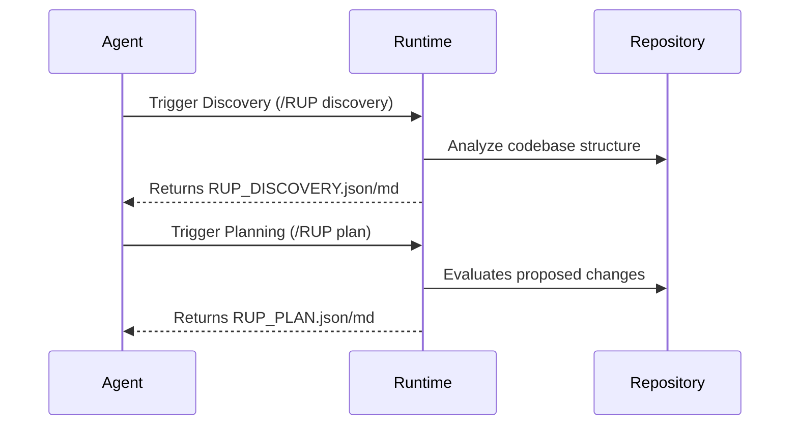

# Architecture

Skill-RUP operates as a bridge between the canonical upstream RUP methodology and the downstream execution capabilities of AI agents.

## Directory Structure
```text
SKILL.md
  -> workflows/                     (Agent readable projections)
  -> protocol/rup-protocol.yaml     (Canonical Authority)
  -> protocol/rup-schema.json       (Validation Authority)
  -> runtime/                       (Deterministic Execution Engine)
  -> schemas/                       (Standalone JSON Schemas)
  -> provenance/                    (Lineage mapping records)
  -> generated artifacts            (Output of the phases)
```

## State & Artifact Flow


## Authority Boundaries
The execution environment separates the theoretical protocol from the runtime implementation. Code under `protocol/` is synchronized directly from upstream and MUST NOT be manually edited downstream. Code under `runtime/` contains the actual execution engine and is strictly managed within this repository.
